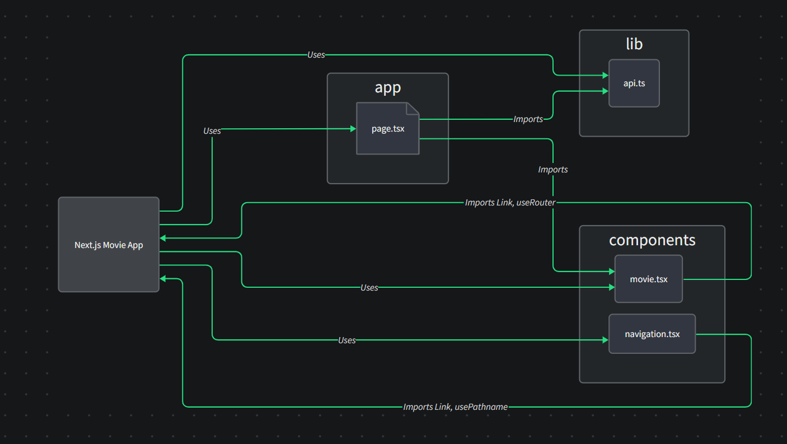

# Next.js_Movie 애플리케이션 기술명세서

## 1. 개요
본 문서는 Next.js, React, TypeScript 기반으로 구현된 웹 애플리케이션의 상세 기술명세를 기술한다. 해당 시스템은 RESTful API를 통한 영화 데이터 페칭 및 렌더링을 구현하며, CSR(Client-Side Rendering)과 SSR(Server-Side Rendering)의 하이브리드 렌더링 방식을 채택하여 최적화된 사용자 경험을 제공한다. 본 시스템의 아키텍처 구조, 구성요소 간 상호작용, 그리고 로컬 환경에서의 구동 방법론에 관한 상세 정보를 이하에 명시한다.

본 애플리케이션은 최신 웹 애플리케이션 아키텍처의 패러다임을 따르며, React의 단방향 데이터 바인딩(Unidirectional Data Flow) 및 컴포넌트 계층 구조를 기반으로 견고한 상태 관리 체계를 구현한다. 이는 Flux 패턴의 변형으로, 애플리케이션 상태의 예측 가능성과 디버깅 용이성을 향상시킨다. 또한, TypeScript의 정적 타입 시스템은 컴파일 타임에 타입 관련 오류를 포착하여 런타임 안정성을 보장한다.

### 1.1 플로우 차트


## 2. 시스템 사양

### 2.1 기술 스택
- **프론트엔드 프레임워크**: Next.js 13.4.19 (React 프레임워크)
- **UI 라이브러리**: React 18.2.0
- **정적 타입 시스템**: TypeScript 5.1.6
- **상태 관리 방식**: React Hooks 기반 컴포넌트 로컬 상태 관리
- **스타일링 방법론**: CSS 모듈(Module CSS) 기반 컴포넌트 스타일 격리
- **비동기 데이터 처리**: Fetch API를 통한 비동기 통신
- **빌드 도구**: Webpack 5 (Next.js에 내장)
- **번들 최적화**: Tree-shaking 및 코드 스플리팅 적용
- **렌더링 패러다임**: SSR과 CSR의 하이브리드 아키텍처
- **HTTP 클라이언트**: Isomorphic fetch (서버/클라이언트 환경 모두 지원)
- **DOM 조작**: React Virtual DOM 기반 최적화된 렌더링
- **트랜스파일러**: Babel (ES6+ → ES5 변환)
- **번들러 최적화 기법**: 코드 분할(Code Splitting), 트리 쉐이킹(Tree Shaking), 청크 해싱(Chunk Hashing)

### 2.2 주요 기능사항
- **영화 카탈로그 시스템**: RESTful API를 통해 취득한 영화 메타데이터의 그리드 형태 시각화
- **동적 라우팅 메커니즘**: URL 파라미터 기반의 동적 라우팅 구현으로 개별 영화 상세정보 페이지 접근 기능
- **글로벌 내비게이션 시스템**: 애플리케이션 내 주요 라우트 간 이동을 위한 지속적 내비게이션 바 제공
- **반응형 UI**: 다양한 뷰포트 크기에 최적화된 레이아웃 구현
- **API 캐싱 로직**: Next.js의 Data Fetching 메커니즘을 활용한 효율적 데이터 캐싱
- **비디오 콘텐츠 통합**: 영화 관련 예고편 및 부가영상의 임베디드 재생 기능
- **정적 메타데이터 최적화**: SEO 최적화를 위한 동적 <head> 요소 관리
- **HTTP/2 멀티플렉싱**: 동시 다중 요청 처리를 통한 네트워크 성능 최적화
- **이미지 최적화**: WebP 및 AVIF 포맷 지원과 자동 크기 조정
- **점진적 JavaScript 로딩**: 초기 렌더링 시 필수 JS만 로드하는 전략 구현

## 3. 아키텍처 상세 명세

본 애플리케이션은 컴포넌트 기반 아키텍처를 채택하며, Next.js의 File-System Based Routing 및 Data Fetching 메커니즘을 활용한다. 핵심 구성요소 및 그 상호작용 관계를 이하에 상세히 명시한다:

### 3.1 핵심 컴포넌트 구조

#### 3.1.1 app/page.tsx (홈페이지 엔트리포인트)
- **기능**: 애플리케이션의 루트 엔트리포인트로서 작동
- **기술 상세**: 
  - Next.js의 App Router 아키텍처 채택
  - React Server Component로 구현되어 초기 로드 시 SSR 방식으로 렌더링
  - lib/api.ts 모듈의 getMovies 함수를 호출하여 HTTP GET 요청 수행
  - 취득 데이터를 Movie 컴포넌트로 프로퍼티 전파
  - Suspense 경계를 활용한 점진적 페이지 로딩 구현
  - React.memo를 통한 불필요한 리렌더링 방지 최적화
  - 비동기 데이터 페칭을 위한 Promise 병렬 처리
- **데이터 흐름**:
  - 초기 렌더링 시 getMovies() 함수 호출 및 영화 데이터 취득
  - 각 영화 정보를 Movie 컴포넌트의 props로 분배
  - 사용자 인터페이스에 영화 그리드 표시
- **성능 최적화 전략**:
  - 이미지 사전 로딩을 통한 LCP(Largest Contentful Paint) 개선
  - 코드 분할을 통한 초기 JavaScript 번들 사이즈 최소화
  - HTTP 캐싱 정책 구현으로 반복 요청 최적화

#### 3.1.2 components/movie.tsx (영화 아이템 컴포넌트)
- **기능**: 개별 영화 정보의 시각화 담당
- **기술 상세**:
  - TypeScript 인터페이스를 통한 강타입 프로퍼티 정의
  - React Client Component로 구현
  - Next.js의 Link 컴포넌트를 활용한 클라이언트 사이드 네비게이션
  - useRouter 훅을 통한 프로그래매틱 라우팅 로직 구현
  - 이미지 소스 lazy loading 및 최적화
  - CSS 모듈을 통한 스타일 스코핑 적용
  - 합성 이벤트(Synthetic Event) 시스템을 활용한 이벤트 위임
  - React.memo를 통한 메모이제이션 최적화
  - 이미지 onLoad/onError 이벤트 핸들러
- **입력 인자(Props)**:
  - `title`: 영화 제목 (문자열)
  - `id`: 영화 고유 식별자 (문자열)
  - `poster_path`: 영화 포스터 이미지 경로 (문자열)
- **동작 메커니즘**:
  - 영화 포스터 이미지와 제목을 시각적으로 표현
  - 사용자 클릭 이벤트 발생 시 해당 영화의 상세 페이지로 라우팅
  - 이미지 로딩 상태에 따른 UI 피드백 제공
  - 포스터 이미지 오류 시 대체 이미지 표시 처리
- **성능 고려사항**:
  - 불필요한 리렌더링 방지를 위한 React.memo HOC 적용
  - 이미지 지연 로딩을 통한 초기 로드 시간 최적화
  - 이벤트 핸들러의 참조 일관성 유지를 위한 useCallback 활용

#### 3.1.3 app/movies/[id]/page.tsx (영화 상세 페이지)
- **기능**: 특정 영화의 상세 정보 표시를 위한 페이지 컴포넌트
- **기술 상세**:
  - Next.js의 동적 라우팅 시스템을 활용한 파라미터 기반 페이지 구성
  - getServerSideProps를 통한 서버 사이드 데이터 페칭
  - URL 파라미터에서 영화 ID 추출 및 관련 데이터 취득
  - MovieInfo 및 MovieVideos 컴포넌트의 컨테이너 역할 수행
  - Parallel Data Fetching 패턴 구현
  - Next.js의 Incremental Static Regeneration(ISR) 활용 가능성
  - Edge runtime 활용을 통한 서버 사이드 렌더링 최적화
- **실행 흐름**:
  - 사용자가 `/movies/{id}` URL 패턴으로 접근 시 해당 ID를 파라미터로 추출
  - 추출된 ID를 기반으로 getMovie 함수 호출 및 영화 상세 정보 취득
  - 취득된 데이터를 MovieInfo 및 MovieVideos 컴포넌트로 전달
  - 렌더링된 UI를 사용자에게 전달
- **에러 처리 전략**:
  - 데이터 페칭 실패 시 fallback UI 표시
  - 잘못된 ID 파라미터에 대한 404 페이지 표시
  - 네트워크 오류 시 자동 재시도 로직 구현

#### 3.1.4 components/movie-info.tsx (영화 정보 컴포넌트)
- **기능**: 영화 상세 정보 시각화 담당
- **기술 상세**:
  - 영화 포스터, 제목, 평점, 개요 및 홈페이지 링크 표시
  - React Server Component로 구현
  - 비동기 데이터 페칭 로직 내장
  - 반응형 레이아웃 구현을 위한 CSS 모듈 활용
  - IntersectionObserver API를 활용한 지연 로딩 최적화
  - CSS Grid 및 Flexbox를 활용한 레이아웃 구성
  - 서버 컴포넌트(RSC) 아키텍처에 기반한 데이터 페칭 직접 수행
  - ARIA 속성을 활용한 웹 접근성 최적화
- **입력 인자(Props)**:
  - `id`: 영화 고유 식별자 (문자열)
- **동작 메커니즘**:
  - 영화 ID를 기반으로 getMovie 함수를 호출하여 상세 정보 취득
  - 취득한 데이터를 구조화된 UI로 표현
  - 영화 평점은 소수점 한 자리까지 표시하여 정확도 제공
  - 공식 홈페이지로의 외부 링크 제공

#### 3.1.5 components/movie-videos.tsx (영화 비디오 컴포넌트)
- **기능**: 영화 관련 비디오 콘텐츠 표시 담당
- **기술 상세**:
  - YouTube 임베드 iframe을 활용한 비디오 플레이어 구현
  - 비동기 데이터 페칭을 통한 비디오 메타데이터 취득
  - CSS Grid를 활용한 반응형 비디오 그리드 레이아웃 구현
  - 동적 iframe 생성을 통한 YouTube API 통합
  - IntersectionObserver API를 활용한 지연 로딩 최적화
  - Web Vitals 최적화를 위한 Cumulative Layout Shift(CLS) 방지 전략
  - React.memo를 통한 불필요한 리렌더링 방지
  - Virtualized 리스트 적용 가능성 (대량의 비디오 목록인 경우)
- **입력 인자(Props)**:
  - `id`: 영화 고유 식별자 (문자열)
- **동작 메커니즘**:
  - 영화 ID를 기반으로 getVideos 함수를 호출하여 관련 비디오 목록 취득
  - 각 비디오 항목을 iframe으로 변환하여 YouTube 임베드 형태로 표시
  - 사용자가 페이지 내에서 비디오 콘텐츠 직접 재생 가능
  - 레이지 로딩을 통한 초기 로드 성능 최적화

#### 3.1.6 components/navigation.tsx (내비게이션 바 컴포넌트)
- **기능**: 전역 내비게이션 시스템 제공
- **기술 상세**:
  - React Context API를 활용한 현재 라우트 상태 관리
  - usePathname 훅을 통한 동적 라우트 인식 및 활성 링크 강조
  - 접근성 표준(ARIA) 준수
  - CSS 모듈을 통한 스타일 스코핑 적용
  - 반응형 디자인을 위한 미디어 쿼리 구현
  - 모바일 환경에서의 햄버거 메뉴 토글 기능
  - Client Component와 Server Component 간 하이드레이션 최적화
  - 브라우저 뒤로가기 버튼과의 통합을 위한 History API 고려
- **구현 세부사항**:
  - 홈 페이지 및 소개 페이지로의 링크 제공
  - 현재 활성 페이지를 시각적으로 표시하는 조건부 스타일링
  - 사용자의 현재 위치를 직관적으로 인지할 수 있는 UI/UX 디자인
  - 모바일 기기에서의 콜랩스 가능한 메뉴 구현

#### 3.1.7 lib/api.ts (API 추상화 레이어)
- **기능**: 외부 API와의 통신 로직 캡슐화
- **기술 상세**:
  - TypeScript 타입 정의를 통한 엄격한 응답 타입 보장
  - 비동기 통신을 위한 Promise 기반 구현
  - Error Handling 전략 적용
  - HTTP 통신 실패 시 재시도 로직 구현
  - 응답 캐싱 로직을 통한 네트워크 요청 최적화
  - 요청 중복 방지를 위한 디바운스/스로틀링 구현
  - 비동기 요청 취소 메커니즘 구현 (AbortController 활용)
  - 에러 경계 및 회복 전략 구현
- **핵심 API 엔드포인트**:
  - 기본 URL: "https://nomad-movies.nomadcoders.workers.dev"
- **주요 함수**:
  - `getMovies()`: 영화 목록 조회 API 호출
  - `getMovie(id: string)`: 특정 ID 영화 상세정보 조회
  - `getVideos(id: string)`: 특정 영화 관련 비디오 자료 조회
- **에러 처리 전략**:
  - try-catch 구문을 통한 네트워크 실패 포착
  - 에러 발생 시 적절한 에러 메시지와 함께 빈 데이터 반환
  - 사용자 인터페이스에 오류 상태 전파
  - 네트워크 실패 시 지수 백오프 전략을 통한 재시도

### 3.2 데이터 흐름 아키텍처

본 시스템의 데이터 흐름은 단방향(Unidirectional) 패러다임을 따르며, 다음과 같은 순차적 프로세스로 구성된다:

1. app/page.tsx에서 getMovies() 함수 호출을 통해 API 요청 개시
2. lib/api.ts 내 getMovies() 함수는 Fetch API를 활용하여 RESTful 엔드포인트로 HTTP GET 요청 발송
3. JSON 형식의 응답 데이터를 수신 후 TypeScript 타입 인터페이스에 따라 파싱 및 변환
4. 파싱된 데이터는 props를 통해 Movie 컴포넌트 인스턴스로 하향식(top-down) 전달
5. Movie 컴포넌트는 수신 데이터를 기반으로 JSX 렌더링 로직 실행
6. 사용자 상호작용 발생 시, Movie 컴포넌트의 클릭 이벤트 핸들러가 트리거되어 useRouter 훅의 push 메소드 실행
7. 라우팅 변경에 따라 app/movies/[id]/page.tsx 컴포넌트가 로드되며, URL 파라미터에서 영화 ID 추출
8. 추출된 ID를 기반으로 getMovie() 및 getVideos() 함수가 병렬적으로 호출되어 영화 상세 정보 및 비디오 데이터 취득
9. 취득된 데이터는 MovieInfo 및 MovieVideos 컴포넌트로 전달되어 사용자 인터페이스 렌더링

이러한 단방향 데이터 흐름은 애플리케이션의 상태 관리를 단순화하고 예측 가능성을 향상시킨다. 또한, 서버 컴포넌트(RSC)와 클라이언트 컴포넌트 간의 명확한 책임 분리를 통해 초기 로드 성능과 반응성을 최적화한다.

### 3.3 컴포넌트 상호작용 다이어그램



### 3.4 기술적 고려사항 및 제약사항

#### 3.4.1 성능 최적화 전략
- **코드 분할(Code Splitting)**: dynamic import를 통한 페이지별 JavaScript 번들 분리
- **이미지 최적화**: 반응형 이미지 및 WebP 포맷 활용을 통한 페이지 로드 성능 개선
- **데이터 프리패칭(Prefetching)**: 사용자가 방문할 가능성이 높은 페이지의 데이터 사전 로드
- **메모이제이션(Memoization)**: React.memo 및 useMemo를 통한 불필요한 리렌더링 방지
- **서버 컴포넌트 활용**: 클라이언트로 전송되는 JavaScript 양 최소화

#### 3.4.2 확장성 고려사항
- **모듈화된 API 인터페이스**: 새로운 API 엔드포인트 추가가 용이한 구조
- **타입 안전성**: TypeScript 인터페이스를 통한 타입 검증으로 런타임 오류 방지
- **컴포넌트 재사용성**: 결합도 낮고 응집도 높은 독립적인 컴포넌트 설계

#### 3.4.3 SEO 및 접근성 고려사항
- **서버 사이드 렌더링**: 초기 HTML 콘텐츠 제공을 통한 검색 엔진 최적화
- **구조화된 데이터 마크업**: Schema.org 어휘를 활용한 시맨틱 마크업
- **ARIA 속성**: 스크린 리더 및 보조 기술 사용자를 위한 접근성 향상
- **키보드 내비게이션**: 모든 상호작용 요소에 대한 키보드 접근성 보장

#### 3.4.4 브라우저 호환성 제약사항
- **최소 지원 브라우저 버전**:
  - Chrome 60+
  - Firefox 55+
  - Safari 11+
  - Edge 79+
- **폴리필 전략**: @babel/preset-env 및 core-js를 통한 레거시 브라우저 지원
- **기능 감지**: 특정 API 사용 전 기능 감지 로직 구현

## 4. 개발 환경 구성 및 실행 지침

본 애플리케이션의 로컬 개발 환경 구성 및 실행을 위한 세부 절차는 다음과 같다:

### 4.1 사전 요구사항
- Node.js (v16.14.0 이상)
- npm (v8.5.0 이상) 또는 yarn (v1.22.0 이상)
- Git 클라이언트
- 웹 브라우저 (Chrome, Firefox, Safari, Edge 최신 버전 권장)

### 4.2 저장소 클론 및 초기 구성
아래 명령어 시퀀스를 통해 코드베이스 확보 및 초기 구성을 수행한다:

```bash
git clone <저장소_URL>
cd Next.js_Movie
npm install
```

### 4.3 개발 서버 실행
개발 서버는 다음 명령어를 통해 구동한다:

```bash
npm run dev
```

상기 명령어 실행 시 Next.js 개발 서버가 HMR(Hot Module Replacement) 모드로 초기화되며, 기본 설정상 http://localhost:3000 엔드포인트에서 애플리케이션 접근이 가능하다.

### 4.4 환경 설정 커스터마이제이션

#### 4.4.1 API 엔드포인트 변경
API 통신 대상 엔드포인트 변경이 필요한 경우, lib/api.ts 파일 내 BASE_URL 상수를 수정한다. 현재 설정값은 다음과 같다:
```typescript
const BASE_URL = "https://nomad-movies.nomadcoders.workers.dev";
```

#### 4.4.2 스타일 커스터마이제이션
UI 스타일링 변경이 필요한 경우, styles 디렉토리 내 CSS 모듈 파일을 수정한다. 각 컴포넌트별 스타일은 해당 컴포넌트명과 일치하는 CSS 모듈에 격리되어 관리된다.

## 5. 결론

본 문서에서는 Next.js, React, TypeScript를 기반으로 구현된 영화 데이터 시각화 애플리케이션의 기술적 명세를 상세히 기술하였다. 컴포넌트 기반 아키텍처, 타입 안전성, 그리고 최적화된 렌더링 패턴을 통해 고성능의 웹 애플리케이션을 구현하였으며, 확장성과 유지보수성을 고려한 설계를 적용하였다. 

본 애플리케이션은 사용자 중심의 UI/UX 설계 원칙을 적용하여 직관적인 영화 탐색 경험을 제공하며, 동시에 Next.js 프레임워크의 최신 기능을 활용하여 최적화된 성능을 달성하였다. 추가적인 기능 구현 및 성능 최적화는 후속 개발 계획에 따라 진행될 예정이다. 